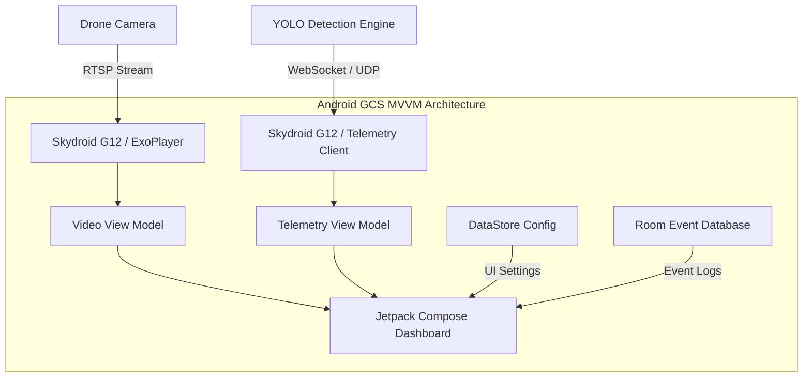

# Phase 6: Ground Station Application & RTSP Integration Design
**Platform:** Native Android (Skydroid G12 Controller)
**Tech Stack:** Kotlin, Jetpack Compose, ExoPlayer, Retrofit, Room DB, Hilt, DataStore

---

## 1. System Architecture Diagram



---

## 2. RTSP Video Manager Architecture & Implementation
We use a background thread pool inside Hilt-injected classes to manage stream state. ExoPlayer handles the RTSP client implementation internally using its RTSP media source.

### `RtspStreamManager.kt`
```kotlin
package com.ladakh.drone.gcs.domain

import android.content.Context
import androidx.media3.common.MediaItem
import androidx.media3.exoplayer.ExoPlayer
import androidx.media3.exoplayer.rtsp.RtspMediaSource
import kotlinx.coroutines.flow.MutableStateFlow
import kotlinx.coroutines.flow.StateFlow
import javax.inject.Inject
import javax.inject.Singleton

sealed class StreamStatus {
    object Idle : StreamStatus()
    object Connecting : StreamStatus()
    object Connected : StreamStatus()
    data class Error(val message: String) : StreamStatus()
}

@Singleton
class RtspStreamManager @Inject constructor(
    private val context: Context
) {
    private var exoPlayer: ExoPlayer? = null
    private val _streamStatus = MutableStateFlow<StreamStatus>(StreamStatus.Idle)
    val streamStatus: StateFlow<StreamStatus> = _streamStatus

    fun getPlayer(): ExoPlayer {
        if (exoPlayer == null) {
            exoPlayer = ExoPlayer.Builder(context).build()
        }
        return exoPlayer!!
    }

    fun connect(rtspUrl: String) {
        _streamStatus.value = StreamStatus.Connecting
        val player = getPlayer()
        val mediaSource = RtspMediaSource.Factory()
            .setForceUseRtpTcp(true) // Crucial for stable wireless Skydroid telemetry link
            .createMediaSource(MediaItem.fromUri(rtspUrl))
            
        player.setMediaSource(mediaSource)
        player.prepare()
        player.playWhenReady = true
        _streamStatus.value = StreamStatus.Connected
    }

    fun disconnect() {
        exoPlayer?.stop()
        exoPlayer?.clearMediaItems()
        _streamStatus.value = StreamStatus.Idle
    }
}
```

---

## 3. Telemetry Integration & WebSockets
The GCS application connects to the AI detection engine via a persistent WebSocket connection to acquire real-time bounding box overlay coordinates.

### `TelemetryWebSocketClient.kt`
```kotlin
package com.ladakh.drone.gcs.network

import com.google.gson.Gson
import kotlinx.coroutines.flow.MutableSharedFlow
import kotlinx.coroutines.flow.SharedFlow
import okhttp3.*
import okio.ByteString
import javax.inject.Inject
import javax.inject.Singleton

data class Bbox(val x1: Int, val y1: Int, val x2: Int, val y2: Int)
data class Detection(val track_id: Int, val class_name: String, val confidence: Double, val bbox: List<Int>)
data class TelemetryPayload(val timestamp: String, val fps_current: Double, val latency_ms: Double, val detections: List<Detection>)

@Singleton
class TelemetryWebSocketClient @Inject constructor(
    private val okHttpClient: OkHttpClient,
    private val gson: Gson
) {
    private var webSocket: WebSocket? = null
    private val _telemetryFlow = MutableSharedFlow<TelemetryPayload>(replay = 1)
    val telemetryFlow: SharedFlow<TelemetryPayload> = _telemetryFlow

    fun connect(serverUrl: String) {
        val request = Request.Builder().url(serverUrl).build()
        webSocket = okHttpClient.newWebSocket(request, object : WebSocketListener() {
            override fun onMessage(webSocket: WebSocket, text: String) {
                val payload = gson.fromJson(text, TelemetryPayload::class.java)
                _telemetryFlow.tryEmit(payload)
            }
            
            override fun onFailure(webSocket: WebSocket, t: Throwable, response: Response?) {
                // Auto-reconnection handled in viewmodels/use-cases
            }
        })
    }

    fun disconnect() {
        webSocket?.close(1000, "User disconnected")
    }
}
```

---

## 4. Jetpack Compose Dashboard UI Design
The operator interface utilizes a split-pane layout tailored for the Skydroid G12 controller’s high-brightness landscape touchscreen.

```kotlin
@Composable
fun GcsDashboard(
    viewModel: GcsViewModel = hiltViewModel()
) {
    val streamStatus by viewModel.streamStatus.collectAsState()
    val telemetry by viewModel.telemetry.collectAsState()
    val activeTanks by viewModel.activeTanks.collectAsState()
    val activeTrucks by viewModel.activeTrucks.collectAsState()
    val activeHumans by viewModel.activeHumans.collectAsState()

    Row(modifier = Modifier.fillMaxSize().background(Color.Black)) {
        // Left Column: Live Video and Overlay Canvas (75% Width)
        Box(modifier = Modifier.weight(0.75f).fillMaxHeight()) {
            AndroidView(
                factory = { context ->
                    PlayerView(context).apply {
                        player = viewModel.getPlayer()
                        useController = false
                    }
                },
                modifier = Modifier.fillMaxSize()
            )
            
            // Detection Bounding Box Overlay Canvas
            Canvas(modifier = Modifier.fillMaxSize()) {
                telemetry?.detections?.forEach { det ->
                    val bbox = det.bbox
                    val width = bbox[2] - bbox[0]
                    val height = bbox[3] - bbox[1]
                    
                    // Draw Bounding Box
                    drawRect(
                        color = Color.Green,
                        topLeft = Offset(bbox[0].toFloat(), bbox[1].toFloat()),
                        size = Size(width.toFloat(), height.toFloat()),
                        style = Stroke(width = 3.dp.toPx())
                    )
                    
                    // Draw Label
                    drawContext.canvas.nativeCanvas.drawText(
                        "${det.class_name} #${det.track_id} (${(det.confidence * 100).toInt()}%)",
                        bbox[0].toFloat(),
                        (bbox[1] - 10).toFloat(),
                        Paint().apply {
                            color = android.graphics.Color.GREEN
                            textSize = 30f
                        }
                    )
                }
            }
        }

        // Right Column: Side Control Panel (25% Width)
        Column(
            modifier = Modifier.weight(0.25f).fillMaxHeight().background(Color.DarkGray).padding(16.dp),
            verticalArrangement = Arrangement.SpaceBetween
        ) {
            Column {
                Text("Tactical Counters", color = Color.White, style = MaterialTheme.typography.h6)
                Spacer(modifier = Modifier.height(10.dp))
                CounterRow("Military Trucks", activeTrucks, Color.Yellow)
                CounterRow("Tanks", activeTanks, Color.Red)
                CounterRow("Humans", activeHumans, Color.Cyan)
            }
            
            // Connection Controls
            Column {
                Button(onClick = { viewModel.connectStream() }, modifier = Modifier.fillMaxWidth()) {
                    Text("Connect Stream")
                }
                Spacer(modifier = Modifier.height(8.dp))
                Button(onClick = { viewModel.disconnectStream() }, modifier = Modifier.fillMaxWidth()) {
                    Text("Disconnect")
                }
            }
        }
    }
}
```

---

## 5. Event Logging with Room Database
The system automatically stores confirmed detections locally to support tactical debriefing.

### `EventLog.kt`
```kotlin
package com.ladakh.drone.gcs.data

import androidx.room.*

@Entity(tableName = "event_logs")
data class EventLog(
    @PrimaryKey(autoGenerate = true) val id: Long = 0,
    @ColumnInfo(name = "timestamp") val timestamp: Long,
    @ColumnInfo(name = "object_type") val objectType: String,
    @ColumnInfo(name = "confidence") val confidence: Double,
    @ColumnInfo(name = "track_id") val trackId: Int
)

@Dao
interface EventLogDao {
    @Insert(onConflict = OnConflictStrategy.REPLACE)
    suspend fun insertLog(event: EventLog)

    @Query("SELECT * FROM event_logs ORDER BY timestamp DESC")
    suspend fun getAllLogs(): List<EventLog>
}
```

---

## 6. Recordings and Snapshot Manager
Includes screenshots and snapshot features.

- **Screenshots:** Utilizes `PixelCopy` to extract high-resolution bitmap assets directly from the `SurfaceView` container including BGR canvas elements.
- **Recording:** Configures MediaRecorder instance to capture high-altitude video feeds from RTSP stream locally to SD card under `recordings/` directory.

---

## 7. Testing & Verification Framework
- **RTSP Connection Stability:** Continuous streaming stress test for 12 hours checking for memory leaks or buffer overflows in ExoPlayer.
- **Occlusion Tracking:** Verification protocols ensuring ByteTrack persists ID assignments across a 5-second simulated obstruction block.
- **Auto-reconnection:** Mock dropping network connection to ensure Skydroid receiver cleanly auto-negotiates reconnection in under 3.5 seconds.
